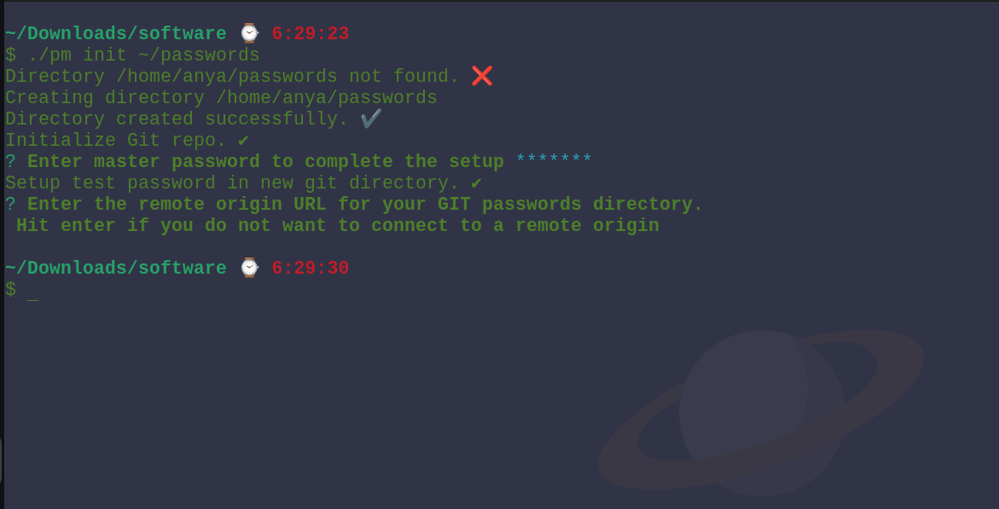

## p_m

A GIT based password manager.

### What's the idea?

The user maintains a private git repository which will store his encrypted passwords.
The terminal CLI will enable him to easily view these passwords and update them as and when necessary.

### Features

1. AES encryption ✔
2. GIT integration ✔
3. Setup new password directory ✔
4. Setup existing git directory ✔
5. Add a new entry ✔
6. Delete an existing entry ✔
7. Update an existing entry ✔
8. List passwords from git directory ✔
9. Change master password - changes all the encrypted passwords ✔
10. View selected password ✔
11. Copy a password to clipboard ❌
12. Connect it to a remote origin ❌
13. Allow user to change the remote origin after initial setup as well ❌

### ToDo
1. Check the `init` command when it persists the password data as JSON. I am facing errors when I run the init command the first time.
2. Add information in README about the `p_m/.config` file that is created by the process and how it can be deleted or fixed in case of errors.

### Screenshots
1. Basic help message that lists all available options in pm

2. An `init` command to setup the git password directory and the master password

3. `add` command to add a password entry.

4. `list` to view all the existing passwords in the password directory.

5. `view` command to view the password for a specific entry.

6. `update` to update an existing password entry.

7. `delete` command to delete an existing password entry.
